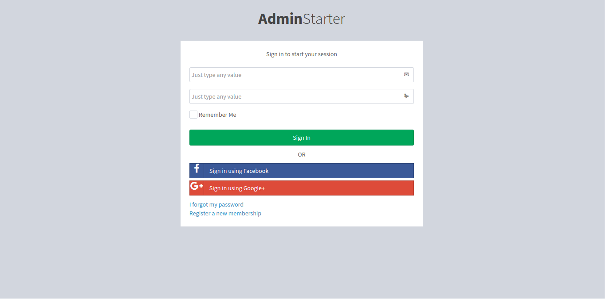
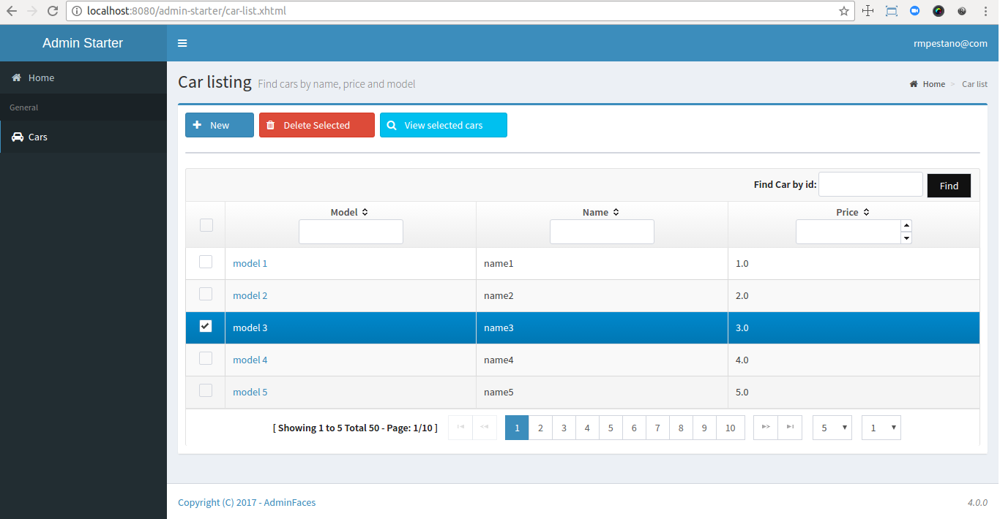
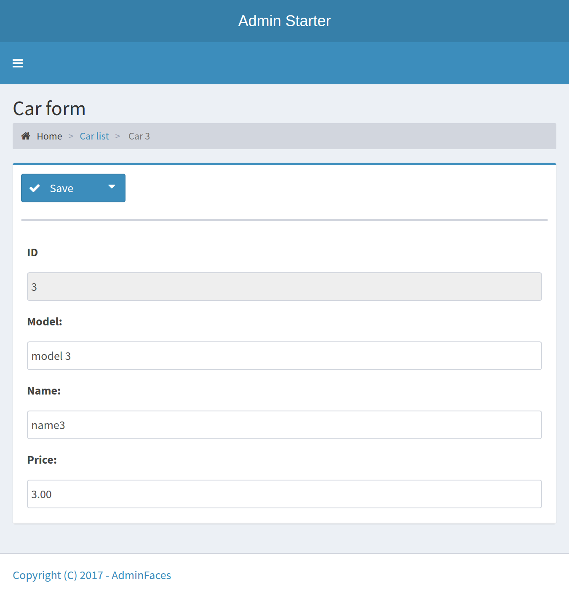

Renato este é seu projeto 

Nós temos uma pequena parte ilustrativa para vc ver como é o funcionamento.

Nesse projeto as seguintes tecnologias foram empregadas na arquitetura: Java 8, Jsf(Mojarra), PrimeFaces, CDI, JPA. 
Gerenciador de build e dependencias:  Apache Maven.
Gerenciador de Versões: Git.

Obs: Não há conexão com banco de dados. Tudo isso deve ser implementado do zero dentro do projeto.

Segue as telas existentes até o momento. Eu já construi todo o template ok.
.Login page

.Car list

.Car form
image:starter3.png[]

.Car form responsive

teste realizado no Tomcat 8.5.3, porém eu configurei para rodar no Jbosse, Wildfly e no GlassFish também.

Importantes.
Amigão iremos usar << --Contextos e Injeção de Dependência (CDI)-->> , especificado por JSR-299 , é uma parte integrante do Java EE e fornece uma arquitetura que permite que os componentes Java EE, como servlets, enterprise beans e JavaBeans, existam dentro do ciclo de vida de um aplicativo. blz?

JSR-299 é uma especificação(Sao interfaces, certo?) entao alguem precisa implementar essas interfaces.

Te apresento a Weld, isso mesmo Weld. (prefiro spring mermo q java II kkk)

é a implementação de referência do CDI para a Plataforma Java EE -  gerenciando o ciclo de vida contextual ,uma das partes mais importantes e populares do Java EE. A Weld está integrada em muitos servidores de aplicativos Java EE, como WildFly , JBoss Enterprise Application Platform , GlassFish , Oracle WebLogic Server , WebSphere Application Server e outros. Weld também pode ser usado em recipientes de servlet simples (Tomcat, Jetty) ou Java SE. 

Pensei numa arquitetura flexível, da pra rodar em todos esses servers ai descritos. Alguns delas ja tem a implementação por default. 
